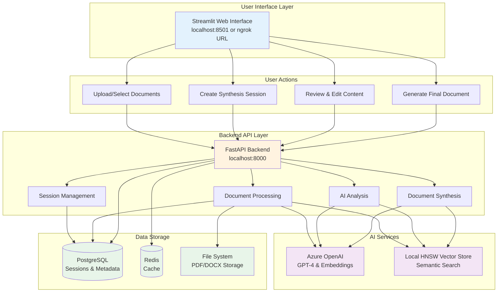
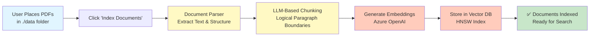
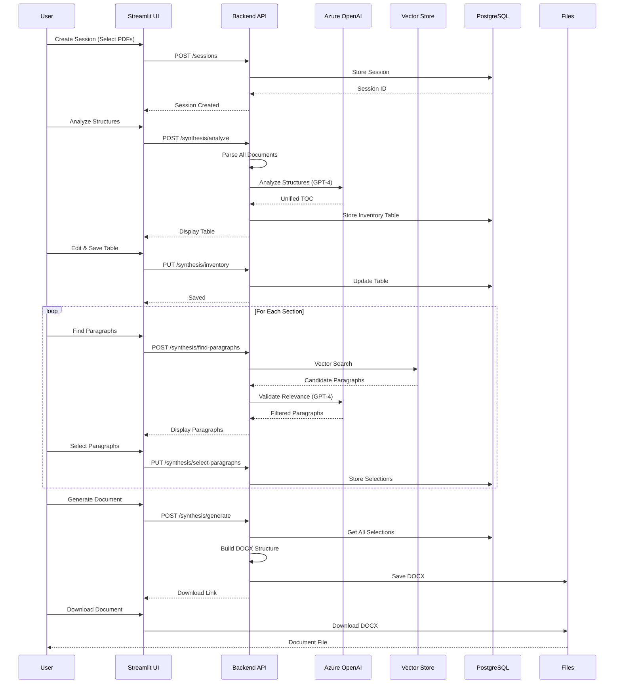
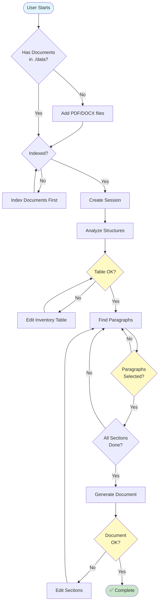
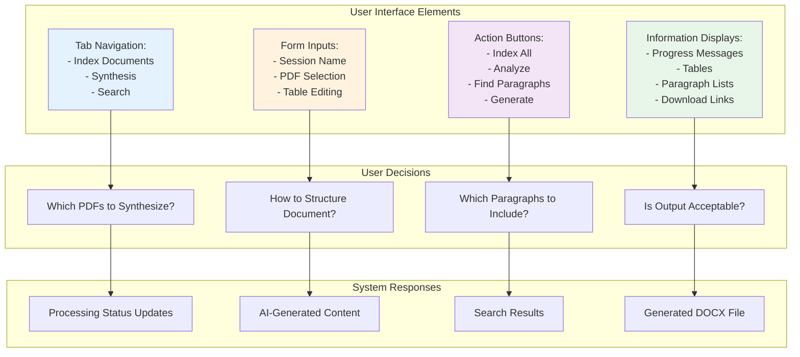

# User Journey - AI Document Cleanup Tool

## Overzicht

Deze applicatie helpt gebruikers om **meerdere documenten te consolideren tot één geïntegreerd document** met behulp van AI. Het proces combineert automatische analyse met menselijke controle, zodat gebruikers de volledige controle behouden over het eindresultaat.

### Hoofdfunctionaliteiten

1. **Document Indexering**: PDF/DOCX bestanden worden geïndexeerd voor semantische zoekopdrachten
2. **Structure Analyse**: AI analyseert documentstructuren en genereert een geïntegreerde inhoudsopgave
3. **Paragraaf Selectie**: Gebruikers selecteren relevante paragrafen per sectie met AI-ondersteuning
4. **Document Generatie**: Het systeem genereert een professioneel DOCX document met alle geselecteerde content

### Gebruikersrollen

- **Process Owner**: Beheert sessies en geeft finale goedkeuring
- **Engineer/Reviewer**: Reviewt AI-voorstellen en selecteert content
- **Viewer**: Bekijkt gegenereerde documenten

## Complete User Workflow

```mermaid
flowchart TD
    Start([User Opens Application]) --> Access{Access Method}
    Access -->|Local| Local[localhost:8501]
    Access -->|Public via Ngrok| Public[ngrok URL]
    
    Local --> Home[Streamlit Home Page]
    Public --> Home
    
    Home --> ChooseTab{Choose Tab}
    
    ChooseTab -->|Index Documents| IndexFlow[Index Documents Tab]
    ChooseTab -->|Synthesis| SynthesisFlow[Synthesis Tab]
    ChooseTab -->|Search| SearchFlow[Search Tab]
    
    %% Index Flow
    IndexFlow --> CheckIndex{Documents<br/>Indexed?}
    CheckIndex -->|No| PlaceFiles[Place PDF/DOCX files<br/>in ./data folder]
    PlaceFiles --> ClickIndex[Click 'Index All Documents']
    ClickIndex --> ProcessIndex[System Processes:<br/>- Parse documents<br/>- LLM-based chunking<br/>- Generate embeddings<br/>- Store in vector DB]
    ProcessIndex --> IndexComplete[✅ Indexing Complete]
    CheckIndex -->|Yes| IndexComplete
    IndexComplete --> BackToHome[Return to Home]
    
    %% Synthesis Flow
    SynthesisFlow --> Step1[Step 1: Create Session]
    Step1 --> EnterName[Enter Session Name]
    EnterName --> SelectPDFs[Select PDF Files<br/>to Synthesize]
    SelectPDFs --> CreateSession[Click 'Create Session']
    CreateSession --> SessionCreated[✅ Session Created]
    
    SessionCreated --> Step2[Step 2: Analyze Structures]
    Step2 --> ClickAnalyze[Click 'Analyze Structures &<br/>Generate Inventory Table']
    ClickAnalyze --> AnalyzeProcess[System Analyzes:<br/>- Document structures<br/>- Headings & sections<br/>- AI generates unified TOC]
    AnalyzeProcess --> InventoryTable[Inventory Table Generated]
    
    InventoryTable --> Step3[Step 3: Review & Edit Inventory]
    Step3 --> EditTable{User Reviews Table}
    EditTable -->|Edit Needed| ModifyTable[User Modifies:<br/>- Add/remove sections<br/>- Change titles<br/>- Adjust hierarchy levels<br/>- Reorder sections]
    ModifyTable --> SaveTable[Click 'Save Inventory Table']
    EditTable -->|OK| SaveTable
    SaveTable --> TableSaved[✅ Table Saved]
    
    TableSaved --> Step4[Step 4: Review Paragraphs by Section]
    Step4 --> ForEachSection{For Each Section}
    ForEachSection -->|Next Section| ClickFind[Click 'Find Paragraphs<br/>for Section']
    ClickFind --> FindProcess[System Finds:<br/>- Vector search for candidates<br/>- LLM validates relevance<br/>- Shows full paragraphs]
    FindProcess --> ReviewParas[User Reviews Paragraphs:<br/>- Reads content<br/>- Checks relevance score<br/>- Views source info]
    ReviewParas --> SelectParas[User Selects Paragraphs<br/>via checkboxes]
    SelectParas --> SaveParas[Click 'Save Paragraph Selections']
    SaveParas --> ForEachSection
    
    ForEachSection -->|All Sections Done| Step5[Step 5: Generate Document]
    Step5 --> ClickGenerate[Click 'Generate Final Document']
    ClickGenerate --> GenerateProcess[System Generates:<br/>- Collects selected paragraphs<br/>- Creates DOCX structure<br/>- Adds headings & formatting<br/>- Includes source references]
    GenerateProcess --> DocReady[✅ Document Generated]
    
    DocReady --> Download[Click 'Download DOCX Document']
    Download --> ReviewDoc[User Reviews Document<br/>in Word/Viewer]
    ReviewDoc --> Satisfied{Document OK?}
    Satisfied -->|No| BackToEdit[Go Back to Edit Sections]
    BackToEdit --> Step4
    Satisfied -->|Yes| Complete[✅ Process Complete]
    
    %% Search Flow
    SearchFlow --> EnterQuery[Enter Search Query]
    EnterQuery --> ClickSearch[Click Search]
    ClickSearch --> SearchProcess[Vector Search Finds:<br/>- Relevant chunks<br/>- Source documents<br/>- Page numbers]
    SearchProcess --> DisplayResults[Display Results with:<br/>- Content preview<br/>- Relevance scores<br/>- Source information]
    DisplayResults --> BackToHome
    
    BackToHome --> ChooseTab
    
    style Start fill:#e1f5ff
    style Complete fill:#c8e6c9
    style IndexComplete fill:#c8e6c9
    style DocReady fill:#c8e6c9
    style SessionCreated fill:#fff9c4
    style TableSaved fill:#fff9c4
    style ProcessIndex fill:#ffccbc
    style AnalyzeProcess fill:#ffccbc
    style FindProcess fill:#ffccbc
    style GenerateProcess fill:#ffccbc
    style SearchProcess fill:#ffccbc
```

## System Architecture from User Perspective

## Document Processing Pipeline

## Synthesis Workflow Detail

## Decision Points & User Choices

## Key User Interactions

